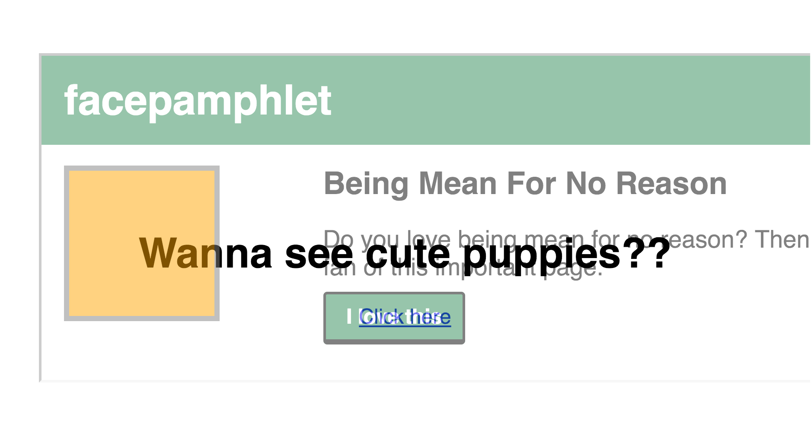

In short: Frameguard mitigates clickjacking attacks by setting the `X-Frame-Options` header.

The attack
----------

[Clickjacking attacks](https://en.wikipedia.org/wiki/Clickjacking) are pretty clever.

The attacker wants you to click something that you don't actually want to click, and they do it by hiding the link/button _behind_ something else that they can trick you into clicking on.

Let's imagine that I've got a social network called Facepamphlet. I'm trying to get you to click "I love this" on my page, "Being Mean For No Reason".


You would never click the "I love this" button on your own, because you're a kind person—you're not a fan of being mean for no reason!

But let's say I send you a website promising hundreds of photos of adorable puppies. You'd click something that let you see all of that! Cute puppies are great!

I send you a page that looks like this:


Of course you want to see cute puppies, so you click "Click here". But, unbeknownst to you, there is an _invisible iframe_ that you've just clicked on!



I've just "clickjacked" you and gotten you to click "I love this" on a page you hate!

Clickjacking can be used to get you to click anything you don't want to. These things include unintentional endorsements on social networks, clicking advertisements, and if it's very clever, tricking you into doing more complex things.

Read more:

- [Clickjacking article on Wikipedia](https://en.wikipedia.org/wiki/Clickjacking)
- [Clickjacking Defense Cheat Sheet](https://www.owasp.org/index.php/Clickjacking_Defense_Cheat_Sheet)
- [iframe element](https://developer.mozilla.org/en-US/docs/Web/HTML/Element/iframe)

The header
----------

The `X-Frame-Options` header tells browsers to prevent your webpage from being put in an iframe. When browsers load iframes, they'll check the value of the `X-Frame-Options` header and abort loading if it's not allowed.

The header has three options:

1. `X-Frame-Options: DENY` will prevent _anyone_ from putting this page in an iframe.
2. `X-Frame-Options: SAMEORIGIN` will prevent anyone from putting this page in an iframe _unless it's on the same origin_. That generally means that you can put your _own_ pages in iframes, but nobody else can.
3. `X-Frame-Options: ALLOW-FROM http://example.com` will allow `http://example.com` to put your page in an iframe, but nobody else. (Unfortunately, you can only allow one domain.)

In the example above, Facepamphlet could mitigate clickjacking attacks by setting the `X-Frame-Options` header to `DENY`, preventing its pages from being put in iframes. Many websites do this.

If you aren't expecting your pages to be put in iframes, setting this to `DENY` or `SAMEORIGIN` is probably a good idea because it limits your page's attack surface.

The header has pretty good browser support: IE8+, Opera 10.50+, Safari 4+, Chrome 4.1+, and Firefox 3.6.9+. The `ALLOW-FROM` header option is [not supported in many browsers](https://developer.mozilla.org/en-US/docs/Web/HTTP/X-Frame-Options#Browser_compatibility). Those browsers will ignore the entire header, [and the frame *will* be displayed](https://www.owasp.org/index.php/Clickjacking_Defense_Cheat_Sheet#Limitations_2).

Read more:

- [MDN](https://developer.mozilla.org/en-US/docs/Web/HTTP/X-Frame-Options)
- [Can I Use X-Frame-Options](http://caniuse.com/#feat=x-frame-options)

The code
--------

Helmet's Frameguard is a relatively simple middleware that will set the `X-Frame-Options` header to whatever you specify.

You can use this module as part of Helmet:

```javascript
// Make sure you run "npm install helmet" to get the Helmet package.
var helmet = require('helmet')

app.use(helmet.frameguard({ action: 'sameorigin' }))
```

You can also use it as a standalone module:

```javascript
// Make sure you run "npm install frameguard" to get the Frameguard package.
var frameguard = require('frameguard')

app.use(frameguard({ action: 'deny' }))
```

Once you've required it, you can use it in your apps:

```javascript
// Don't allow me to be in ANY frames.
// Sets "X-Frame-Options: DENY".
app.use(frameguard({ action: 'deny' }))

// Only let me be framed by people of the same origin.
// Sets "X-Frame-Options: SAMEORIGIN".
app.use(frameguard({ action: 'sameorigin' }))
app.use(frameguard())  // defaults to sameorigin

// Allow from a specific host.
// Sets "X-Frame-Options: ALLOW-FROM http://example.com".
app.use(frameguard({
  action: 'allow-from',
  domain: 'http://example.com'
}))
```

This header is included in the default Helmet bundle and it uses its default value, `SAMEORIGIN`.
